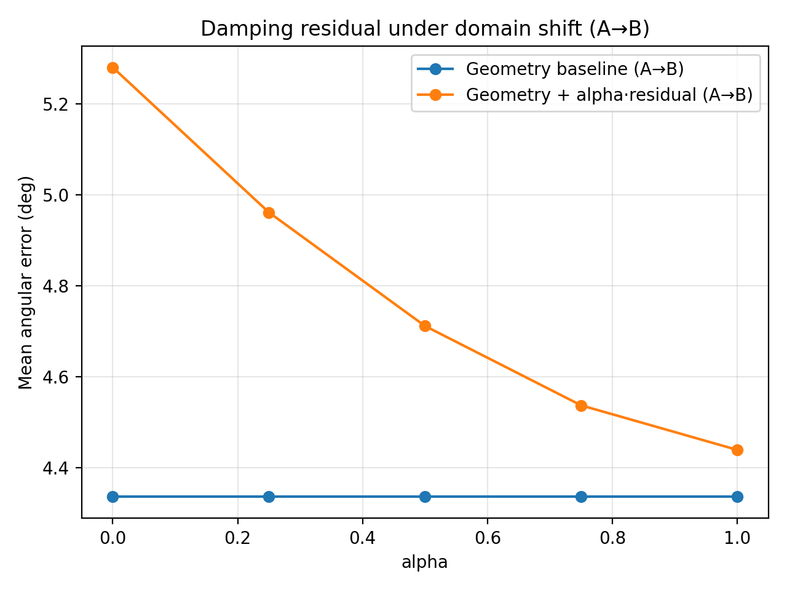
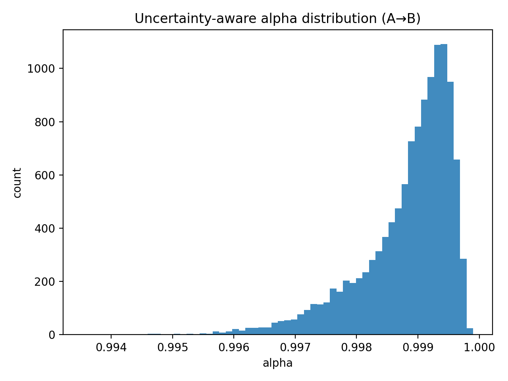

# Geometry-Aware Gaze Estimation (Research Prototype)

[](https://www.python.org/)
[](LICENSE)

**Key artifacts**
- `figures/domain_shift.png` – domain shift evaluation (A→A, A→B, B→B)
- `figures/error_hist.png` – error distribution (baseline vs residual)
- `figures/results.txt` – numeric summary

This repository provides a **minimal, reproducible baseline** for gaze estimation that combines:
1) a **geometry-inspired model** (head pose + relative eye angles), and  
2) a **small learned residual correction** (MLP) to compensate for systematic biases / domain effects.

The goal is to demonstrate **geometry-aware inductive bias** and a clean research workflow (setup → run → results).

## Why geometry (context)
Generic large vision foundation models are often optimized for semantic invariances and may underutilize subtle, geometry-sensitive cues.  
For gaze estimation, **small angular differences matter**; geometry-aware baselines can be strong and sample-efficient, and learning can be used to model residual errors.

## Research context (short)
- Synthetic data is used to provide controlled ground truth for early-stage model development.
- Geometry baseline captures essential relationships (head/eye → gaze), improved via learned residual.
- Domain shift illustrates typical challenges when deployed across varying conditions.
- This prototype is a foundation for future extension to real datasets and cross-species gaze estimation.

## Quickstart
```bash
python -m venv .venv
source .venv/bin/activate   # Windows: .venv\Scripts\activate
pip install -r requirements.txt
python -m src.cli --mode train
```

## Reproducibility
The experiments are deterministic (fixed seeds). Run:

```bash
python -m venv .venv
source .venv/bin/activate   # Windows: .venv\Scripts\activate
pip install -r requirements.txt
python -m src.learning.train
```

## Results (synthetic demo)
The synthetic experiment demonstrates that a geometry-inspired baseline can be strong, and that a small learned
residual can correct systematic biases.

**Files:**
- `figures/results.txt` (numbers)
- `figures/error_hist.png` (distribution)

### Quantitative summary

Here are the mean angular errors (degrees) from synthetic evaluation:

| Evaluation setting | Baseline (deg) | Geometry + Learned (deg)  |
|--------------------|----------------|---------------------------|
| A → A              | 2.675          | 1.761                     |
| A → B              | 4.335          | 4.439                     |
| B → B              | 4.335          | 2.993                     |

*(Values extracted from `figures/results.txt`)*

This table shows that learning a residual correction improves performance within domain and can partially mitigate domain shift.


### Domain shift (synthetic)
We simulate domain shift by changing systematic bias and observation noise between **Domain A** and **Domain B**.
This mirrors common real-world issues (different cameras, subjects, illumination, annotation noise).


### Residual damping under domain shift (A→B)
A residual model trained on Domain A can **overcorrect** on Domain B (negative transfer).  
We mitigate this by damping the residual: **prediction = geometry + α · residual**.



### Automatic residual damping via uncertainty (MC dropout)
Under domain shift, a residual trained on Domain A can overcorrect on Domain B.  
We estimate prediction uncertainty using **MC dropout** and set **α(x) = 1 / (1 + k·Var(residual))**.  
Higher uncertainty → smaller α → safer reliance on geometry.



## Synthetic-to-real training pipeline
The figure below summarizes a practical way to use synthetic data: **pretrain → adapt → evaluate**.


**Legend:**
1. **Synthetic pretraining:** train on large-scale synthetic scenes with precise ground-truth gaze/head-pose labels.
2. **Domain adaptation:** reduce domain gap using a mixture of synthetic+real data (fine-tuning, feature alignment, etc.).
3. **Real-world evaluation:** evaluate on real benchmarks to measure generalization.

## Short research notes (aligned with UniGaze-style insights)
### Why generic large foundation models may underperform on gaze estimation
Gaze estimation is **fine-grained and geometry-sensitive**. Generic foundation models are often optimized for semantic
invariances and global representations, which can underutilize subtle cues (eye region appearance, small head pose changes,
camera geometry). Task-specific inductive biases and geometry-aware modeling can outperform generic pretraining when data is
limited and precision is critical.

### Extending gaze estimation to apes (high-level plan)
- Use **anatomy-aware geometry** (species-specific eye/head parameters).
- Train with **shared backbone + species-specific heads**.
- Apply **domain adaptation** to align human/ape representations.
- Use **synthetic 3D animal models** + domain randomization to compensate for limited real annotations.

### Human subject video data: typical issues and mitigation
- Privacy/consent & legal constraints → strong governance, consent, anonymization.
- Demographic bias → balanced datasets, bias evaluation.
- Annotation noise → probabilistic labels, multi-stage supervision, quality control.

### Synthetic data for multi-human gaze detection: pros/cons and best use
**Pros:** scalable, cheap labels, perfect ground truth, controllable scenarios.  
**Cons:** domain gap, unrealistic behavior/appearance, risk of learning artifacts.  
**Best use:** pretrain/augment + domain randomization + fine-tune on real data + continuous real-world validation.

## Portfolio note
This repository is a compact research prototype created as part of my PhD application portfolio.
It demonstrates geometry-aware inductive bias, clean experimental structure, and synthetic-to-real reasoning.

## Roadmap (next steps)
- Replace synthetic generator with a real gaze dataset and add evaluation protocols (angular error, calibration).
- Add a lightweight feature extractor (e.g., eye crop encoding) and compare geometry-only vs geometry+features.
- Extend to cross-species setting (apes) via anatomy-aware parameters + domain adaptation and synthetic 3D animal models.