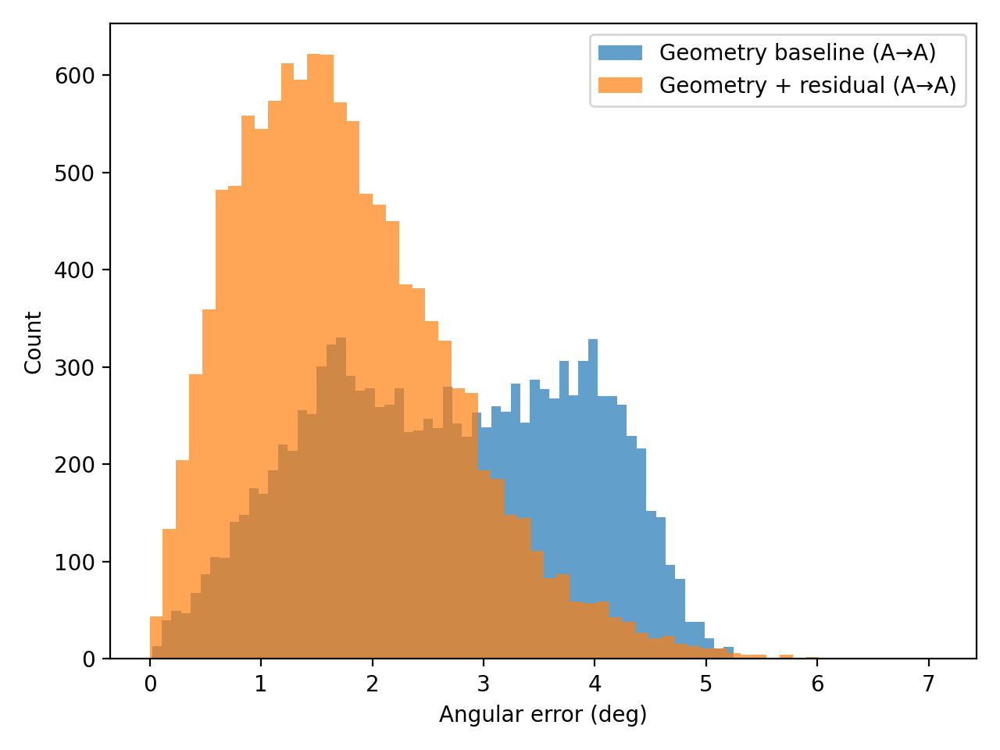
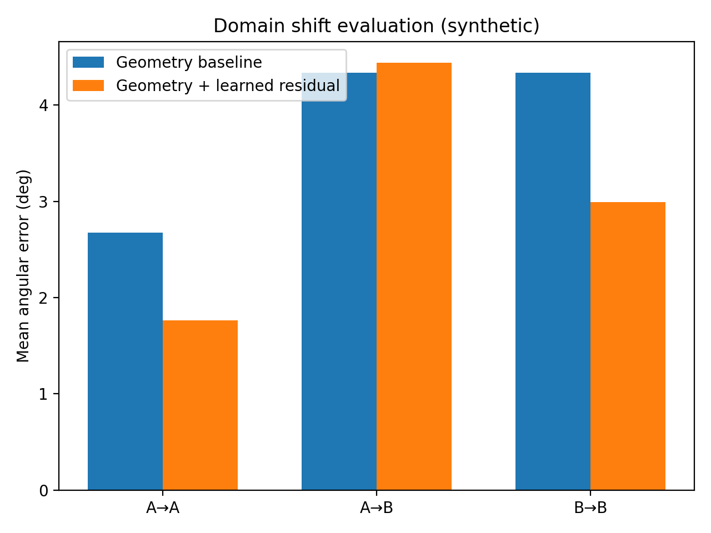
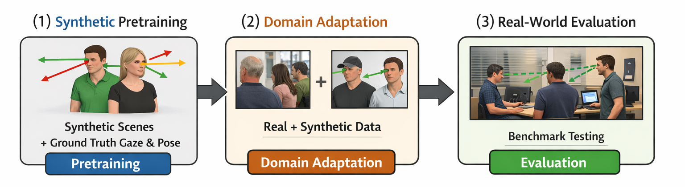

# Geometry-Aware Gaze Estimation (Research Prototype)

This repository provides a **minimal, reproducible baseline** for gaze estimation that combines:
1) a **geometry-inspired model** (head pose + relative eye angles), and  
2) a **small learned residual correction** (MLP) to compensate for systematic biases / domain effects.

The goal is to demonstrate **geometry-aware inductive bias** and a clean research workflow (setup → run → results).

## Why geometry (context)
Generic large vision foundation models are often optimized for semantic invariances and may underutilize subtle, geometry-sensitive cues.  
For gaze estimation, **small angular differences matter**; geometry-aware baselines can be strong and sample-efficient, and learning can be used to model residual errors.

## Quickstart
```bash
python -m venv .venv
source .venv/bin/activate   # Windows: .venv\Scripts\activate
pip install -r requirements.txt
python -m src.cli --mode train
```

## Results (synthetic demo)
The synthetic experiment demonstrates that a geometry-inspired baseline can be strong, and that a small learned
residual can correct systematic biases.

**Files:**
- `figures/results.txt` (numbers)
- `figures/error_hist.png` (distribution)



### Domain shift (synthetic)
We simulate domain shift by changing systematic bias and observation noise between **Domain A** and **Domain B**.
This mirrors common real-world issues (different cameras, subjects, illumination, annotation noise).



## Synthetic-to-real training pipeline
The figure below summarizes a practical way to use synthetic data: **pretrain → adapt → evaluate**.



**Legend:**
1. **Synthetic pretraining:** train on large-scale synthetic scenes with precise ground-truth gaze/head-pose labels.
2. **Domain adaptation:** reduce domain gap using a mixture of synthetic+real data (fine-tuning, feature alignment, etc.).
3. **Real-world evaluation:** evaluate on real benchmarks to measure generalization.

## Short research notes (aligned with UniGaze-style insights)
### Why generic large foundation models may underperform on gaze estimation
Gaze estimation is **fine-grained and geometry-sensitive**. Generic foundation models are often optimized for semantic
invariances and global representations, which can underutilize subtle cues (eye region appearance, small head pose changes,
camera geometry). Task-specific inductive biases and geometry-aware modeling can outperform generic pretraining when data is
limited and precision is critical.

### Extending gaze estimation to apes (high-level plan)
- Use **anatomy-aware geometry** (species-specific eye/head parameters).
- Train with **shared backbone + species-specific heads**.
- Apply **domain adaptation** to align human/ape representations.
- Use **synthetic 3D animal models** + domain randomization to compensate for limited real annotations.

### Human subject video data: typical issues and mitigation
- Privacy/consent & legal constraints → strong governance, consent, anonymization.
- Demographic bias → balanced datasets, bias evaluation.
- Annotation noise → probabilistic labels, multi-stage supervision, quality control.

### Synthetic data for multi-human gaze detection: pros/cons and best use
**Pros:** scalable, cheap labels, perfect ground truth, controllable scenarios.  
**Cons:** domain gap, unrealistic behavior/appearance, risk of learning artifacts.  
**Best use:** pretrain/augment + domain randomization + fine-tune on real data + continuous real-world validation.

## Portfolio note
This repository is a compact research prototype created as part of my PhD application portfolio.
It demonstrates geometry-aware inductive bias, clean experimental structure, and synthetic-to-real reasoning.