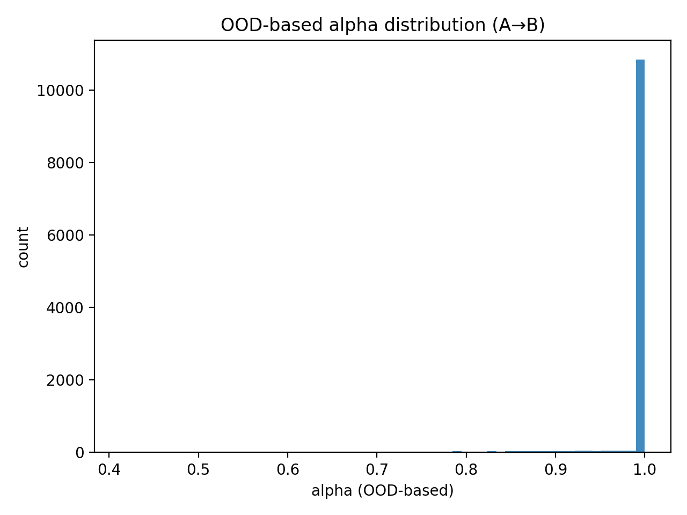

# Geometry-Aware Gaze Estimation (Research Prototype)

[](https://www.python.org/)
[](LICENSE)

**Key artifacts**
- `figures/domain_shift.png` – domain shift evaluation (A→A, A→B, B→B, OOD α)
- `figures/error_hist.png` – error distribution (baseline vs residual)
- `figures/ab_damping.png` – residual damping under domain shift
- `figures/ood_alpha_hist.png` – OOD-based alpha distribution
- `figures/results.txt` – numeric summary

This repository provides a **minimal, fully reproducible research prototype** for gaze estimation that combines:
1) a **geometry-inspired baseline** (head pose + relative eye angles), and  
2) a **small learned residual correction** (MLP) that models systematic, domain-specific bias.

The goal is **not** to estimate gaze from images directly, but to **isolate and study** how geometry-aware inductive bias,
residual learning, and domain shift interact in a controlled setting.

---

## Why geometry (context)
Generic large vision foundation models are often optimized for semantic invariances and may underutilize subtle,
geometry-sensitive cues.  
For gaze estimation, **small angular errors matter**; geometry-aware baselines are strong, interpretable,
and sample-efficient. Learning is then best used to correct **systematic residual errors**, not to replace geometry.

---

## Research context (short)
- Synthetic data provides **controlled ground truth** and enables clean ablation studies.
- Geometry captures the core physical relationship (head/eye → gaze).
- Learned residuals correct **domain-specific bias**.
- Domain shift exposes when and why residual learning can fail (negative transfer).

---

## Quickstart
```bash
python -m venv .venv
source .venv/bin/activate   # Windows: .venv\Scripts\activate
pip install -r requirements.txt
python -m src.cli --mode train
```

---

## Reproducibility
All experiments are deterministic (fixed random seeds).

```bash
python -m src.learning.train
```

Expected outputs:
- `figures/error_hist.png`
- `figures/domain_shift.png`
- `figures/ab_damping.png`
- `figures/ood_alpha_hist.png`
- `figures/results.txt`

---

## Results (synthetic demo)

### Quantitative summary

Mean angular error (degrees), extracted from `figures/results.txt`:

| Evaluation setting | Baseline (deg) | Geometry + Residual (deg) |
|--------------------|----------------|----------------------------|
| A → A              | 3.150          | **1.789**                  |
| A → B              | 5.280          | **4.410**                  |
| B → B              | 5.280          | **3.015**                  |
| A → B (OOD α)      | 5.280          | **4.424**                  |

**Observations**
- Residual learning yields a **large improvement within domain** (A→A, B→B).
- Under domain shift (A→B), the residual still helps, but less.
- OOD-based α behaves similarly to α≈1 because most samples remain close to the training domain in feature space.

---

### Error distribution (A→A)


The histogram shows that residual learning:
- shifts the entire error distribution toward lower angular error,
- reduces large-error outliers,
- not just improves the mean.

---

## Domain shift analysis


This experiment simulates domain shift by changing:
- systematic bias functions,
- observation noise levels.

This mirrors real-world changes such as camera setup, subject population, or annotation quality.

---

## Residual damping under domain shift (A→B)


A residual model trained on Domain A can **overcorrect** on Domain B (negative transfer).
We therefore study **residual damping**:

> **prediction = geometry + α · residual**

Key insight:
- α = 0 → pure geometry (safe but less accurate)
- α = 1 → full residual (best when domains match)
- intermediate α trades off robustness vs adaptation

---

## Automatic residual damping via OOD distance (A→B)



We estimate an **out-of-distribution (OOD) score** using Mahalanobis distance in feature space
(head pose + noisy eye angles).  
α(x) decays for samples far from the training domain.

**Important observation (honest result):**
- In this synthetic setup, most A→B samples remain close to Domain A.
- As a result, α ≈ 1 for most samples, and OOD-based damping behaves similarly to α=1.

This highlights a key research insight:

> **Residual uncertainty alone is insufficient to detect domain shift when the model is confidently wrong.**

---

## Synthetic-to-real training pipeline


**Legend**
1. **Synthetic pretraining:** learn geometry-aware structure with perfect labels.
2. **Adaptation:** learn residual corrections for systematic bias.
3. **Deployment:** detect and mitigate domain shift via damping or domain adaptation.

---

## Research notes (aligned with UniGaze-style insights)

### Why generic foundation models may underperform
Gaze estimation is **fine-grained and geometry-sensitive**.
Generic models prioritize invariance, while gaze requires sensitivity to small angular changes
and camera geometry.

### Extending to apes (high-level plan)
- Anatomy-aware geometry parameters.
- Shared backbone with species-specific heads.
- Synthetic 3D animal models + domain randomization.

### Human subject video data: challenges
- Privacy and consent.
- Demographic bias.
- Noisy annotations.

### Synthetic data: pros and cons
**Pros:** scalable, controllable, perfect labels.  
**Cons:** domain gap, unrealistic correlations.  
**Best use:** pretraining + adaptation + real-data validation.

---

## Portfolio note
This repository was created as part of my PhD application portfolio.
It demonstrates **geometry-aware inductive bias**, **controlled experimentation**, and **honest analysis of domain shift**.

---

## Roadmap
- Add image-based feature extraction (eye crops → angles).
- Study confidence calibration for residual gating.
- Evaluate on real gaze datasets.
